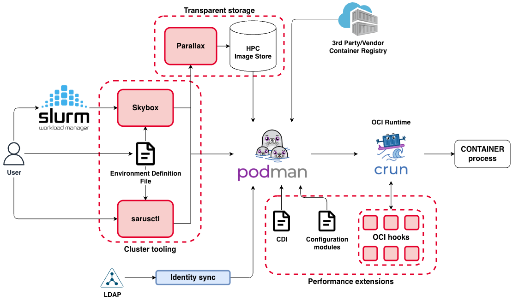

# High-level architecture

At a high level, Sarus Suite wraps the existing OCI stack instead of replacing it:

- **Cluster tooling**: `sarusctl`, the EDF and the `Skybox` Slurm SPANK plugin orchestrate container launches in a scheduler-aware way.
- **Transparent storage**: `Parallax` turns pulled images into read-only SquashFS images on a shared image store in the cluster Parallel Filesytem, avoiding redundant pulls across nodes.
- **Performance extentions**: CDI configurations, OCI hooks, Podman configuration modules, bundled in the performance extensions, ensure access to accelerators, devices, and optimized HPC libraries and tools, alongside tuned namespaces / cgroups configurations.
- **OSS Runtime layer**: Podman and runtimes like `crun` run containers using the configuration settings and extensions provided by the Sarus-Suite.

For more detail on each component, see the [Component index](../components/index.md). 

